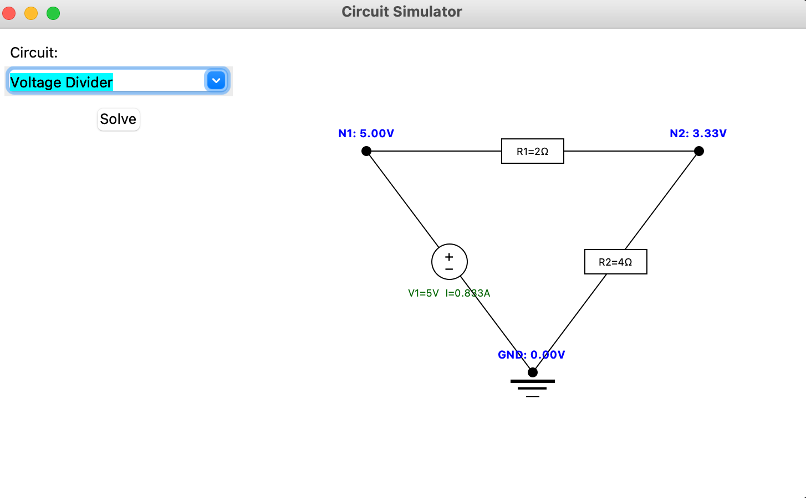
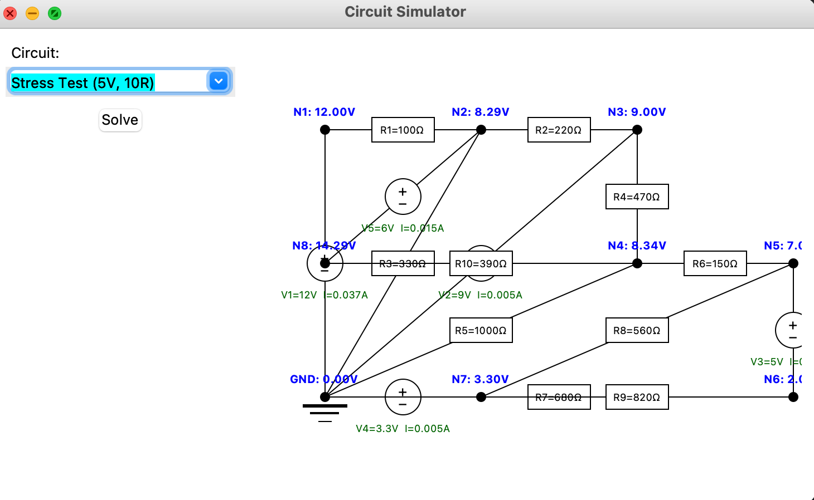

# Circuit Simulator

A circuit simulator built from scratch in Python using Modified Nodal Analysis (MNA).

## How it works

Each component stamps its contribution into a conductance matrix,
then numpy solves the resulting system:

